```{r setup, include=FALSE}
knitr::opts_chunk$set(echo = TRUE, cache=TRUE)
library(glitter)
library(kableExtra)
show=function(dt){kbl(dt) %>%
  kable_styling(bootstrap_options = c("hover","condensed"),
                full_width = F,
                position = "float_left",
                font_size = 20)}
```

#
<h2> Histoire du projet </h2>

# Projet: mon métier

<!-- - approche non pas du point de vue du producteur de données mais plutôt de celle de l'utilisateur de données -->

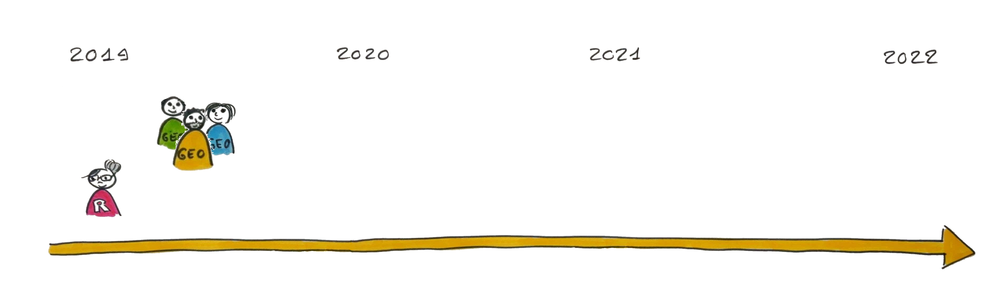{width=1200px}

- **Analyste de données** dans un labo de géographie (UMR 5600 Environnement Ville Société)

- Rôle **pédagogique**: aider les collègues à **utiliser R** pour leurs analyses/valorisation (blog[🔗](http://perso.ens-lyon.fr/lise.vaudor/))

- Travail d'**appui à la recherche** => développement d'outils d'analyse, recueil de données du web (API, web-scraping...)

# Projet: Les données (participatives) du web

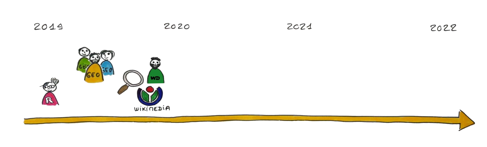{width=1200px}

- Intérêt pour les **données du web** (réseaux sociaux, projet Wikimedia)
- Découverte du **web des données** (LOD: Linked Open Data) via les Wikidata 
    + données en **graphes**
    + **triplets** de données (s-v-o)

# Projet: RECIT

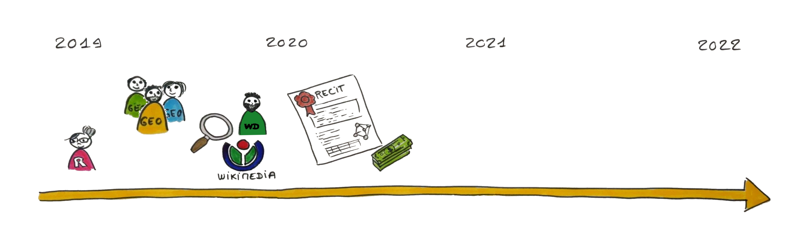{width=1200px}

Projet émergent ENS **RECIT** 

=> **R** pour l'**E**xploration et la **C**ollecte **I**ntégrée de **T**riplets de données 

- **stage M2** (2021)
- **développement du package R glitter** (2021-2022)
- **prestation dév** (2022) pour amélioration du package glitter (stabilité, maintenance, dépôt sur CRAN)

# Projet: Cas d'études

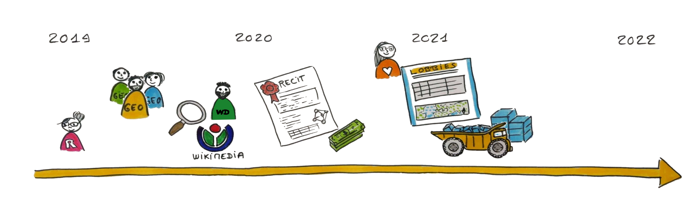{width=1200px}

Recrutement de **Camille Scheffler** (stage M2) et exploration des Wikidata pour deux cas d'études:

- Les **jumelages** en Europe et dans le monde (Camille Scheffler, Ninon Briot,ATER ENS de Lyon)
- Le [**lobbyisme** aux USA](http://geoconfluences.ens-lyon.fr/informations-scientifiques/a-la-une/carte-a-la-une/lieux-de-pouvoir-lobbying-etats-unis) (Camille Scheffler, Florence Nussbaum, MCF ENS de Lyon)

# Projet: Package glitter

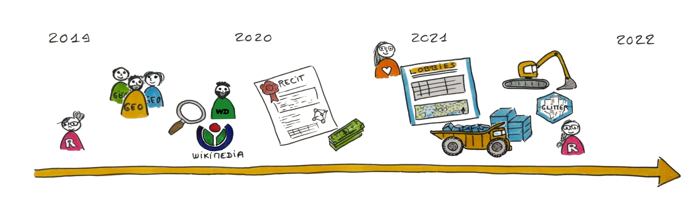{width=1200px}

En lien (et en parallèle) aux cas d'études de Camille, **développement du package R `glitter`**.
<br>

🎯 Objectifs:

Promouvoir l'usage (exploration, recueil, analyse) des LOD pour les chercheurs et étudiants usagers de R, en:

- facilitant l'**écriture** des requêtes SPARQL
- facilitant l'**envoi** des requêtes
- facilitant le **nettoyage** des résultats pour une analyse/valorisation ultérieure dans R

# Projet: quelques rappels sur les LOD/ web des données

{width=1500px}

# Projet: quelques rappels sur les LOD/ web des données

{width=1500px}

# Projet: Difficultés d'appropriation des LOD


- 👀 ce qu'on appréhende directement: le **web documentaire**
- 💭 difficultés liées à la structure des données en **graphes**
    + visualisation souvent **incomplète** du graphe (modèle de données) 
    + métadonnées intégrées aux données => il faut collecter les données pour comprendre ce qu'il y a dedans
    + Transformation en données **tabulaires** pour analyse 
    
{height=550px}

# Projet: Difficultés de collecte

<table><tr><td width='30%'>

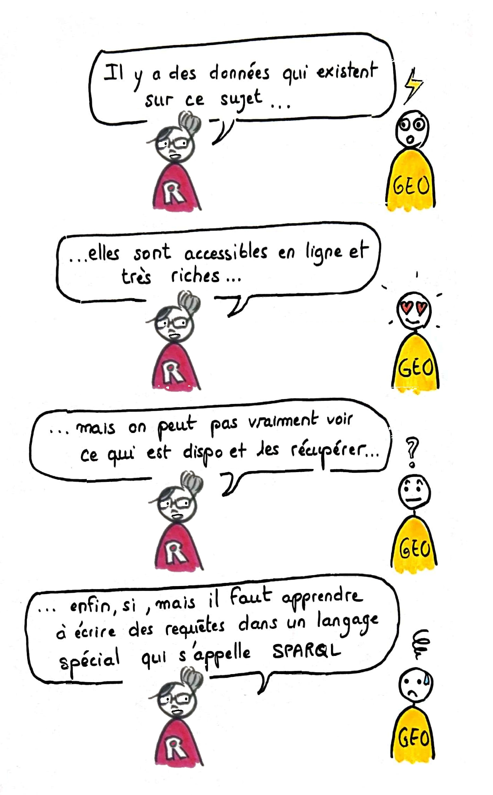{height=800px}
</td><td width='70%'>

Importance des **exemples de requêtes SPARQL** pour explorer les bases de données

Or, le langage SPARQL est **spécifique** à 

- cette **étape** (dans l'analyse) du recueil de données
- ce **type** de données (les Linked Open Data)


{width=1100px} 

</tr></table>

# Projet: avancement

<table><td style="width:30%">
Un **petit** projet ... (projet émergent ENS, 20 000 euros sur 3 ans). 🐈


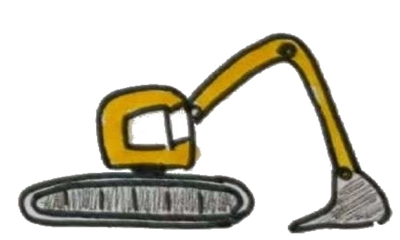{width=100px} Un package **en cours de développement** => amélioration à prévoir début 2022.

</td><td>
{width="50px"} Package installable et modifiable [ici](https://github.com/lvaudor/glitter).

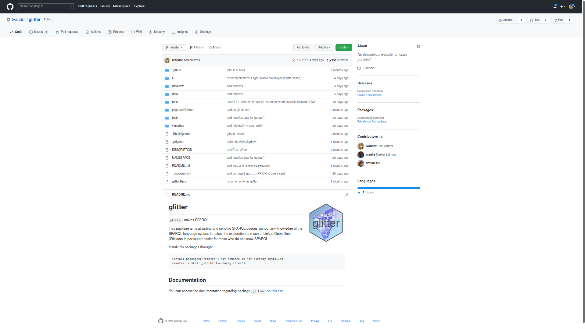
</td></table>

#

<h2> Entrée par les Wikidata </h2>

# Wikidata: exploration côté "documentaire"

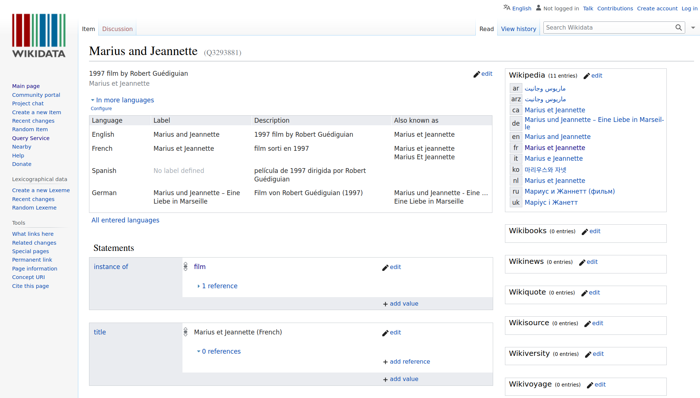{width=1400px}

[🔗Lien](https://www.wikidata.org/wiki/Q3293881)

# Wikidata: exploration côté "données" 

Passage par le **Wikidata Query Service (WDQS)**

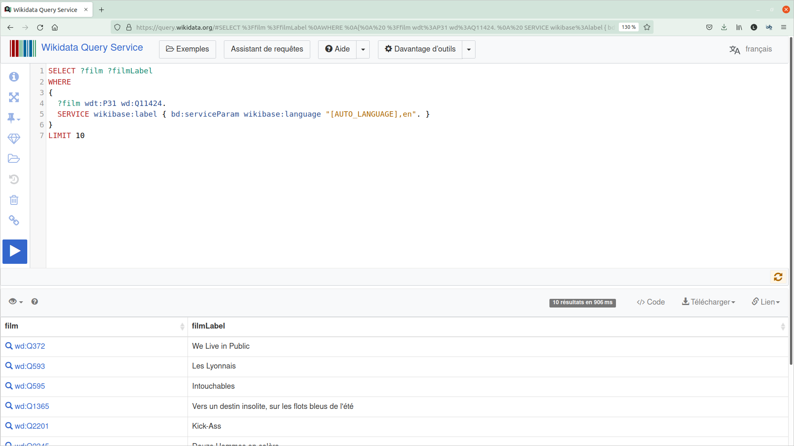{width=1400px}

[🔗Lien](https://query.wikidata.org/#SELECT%20%3Ffilm%20%3FfilmLabel%20%0AWHERE%20%0A%7B%0A%20%20%3Ffilm%20wdt%3AP31%20wd%3AQ11424.%20%0A%20%20SERVICE%20wikibase%3Alabel%20%7B%20bd%3AserviceParam%20wikibase%3Alanguage%20%22%5BAUTO_LANGUAGE%5D%2Cen%22.%20%7D%0A%7D%0ALIMIT%2010)

<!-- bcp expérimenté SPARQL et triplets de données par ce biais car existe exemples, documentation, et ressources accessibles par web documentaire -->

# Wikidata: focus sur le SPARQL endpoint (depuis le navigateur)

```{SPARQL_initial}
SELECT ?film ?filmLabel 
WHERE {
  ?film wdt:P31 wd:Q11424.
  SERVICE wikibase:label {
    bd:serviceParam wikibase:language "[AUTO_LANGUAGE],en". 
  } 
}
LIMIT 10
```

- ✍️ Rédaction de la requête SPARQL
- ⚙️ Exécution depuis le SPARQL endpoint (navigateur web)
- 📥 Affichage/Téléchargement des résultats 

# Wikidata: focus sur le code depuis R

```{r SPARQL_in_R, eval=FALSE}
query='SELECT ?film ?filmLabel 
WHERE {
  ?film wdt:P31 wd:Q11424.
  SERVICE wikibase:label {
    bd:serviceParam wikibase:language "[AUTO_LANGUAGE],en".
  }
}'

result=purrr::quietly(WikidataQueryServiceR::query_wikidata)(query)
tib=result$r
```

- ✍️ Rédaction de la requête SPARQL
- ⚙️ Exécution depuis R
- 🎁 Récupération du tableau de résultats en tant qu'objet R

🎯 Chaîne de traitement reproductible

# Wikidata: focus sur le code depuis R, avec glitter

```{r glitter_no_SPARQL}
tib=spq_init() %>% 
  spq_add("?film wdt:P31 wd:Q11424", label="?film") %>% 
  spq_head(n=10) %>% 
  send()
```
<!-- Sans limite, cette requête retournerait 267307 résultats (fonctionne avec glitter, requête directe sur WDQS entraînte Timeout) -->


- ✍️  ⚙️ Rédaction et envoi de commandes R
- 🎁 Recueil du tableau de résultats en tant qu'objet R

```{r show_result_init, echo=FALSE}
head(tib) %>% show()
```

# Wikidata: avant-après glitter

Avant:

```{r bef_glitter, eval=FALSE}
query='SELECT ?film ?filmLabel WHERE {
  ?film wdt:P31 wd:Q11424.
  SERVICE wikibase:label {
    bd:serviceParam wikibase:language "[AUTO_LANGUAGE],en".
  }
}
LIMIT 10'
result=WikidataQueryServiceR::query_wikidata(query)
tib=result$r
```

Après:
```{r aft_glitter, eval=FALSE}
tib=spq_init() %>% 
  spq_add("?film wdt:P31wd:Q11424", label="?film") %>% 
  spq_head(n=10) %>% 
  send()
```

#

<h2> Exemple de requête et valorisation: lieux de fiction </h2>

# Ex. lieux de fiction: que veut-on faire?

- 🎥 On souhaite récupérer dans Wikidata les données relatives aux films,
- 📍 notamment le lieu de la narration (et les coordonnées associées), 
- 🌍 pour les placer sur une carte.

[🔗Lien](https://www.wikidata.org/wiki/Q3293881)

# Ex. lieux de fiction: on peut récupérer les données

```{r req1_lf}
tib=spq_init() %>%                                       # Initialise requête puis
  spq_add("?film wdt:P31 wd:Q11424", label="?film") %>%  # Ajoute triplet "?film est une instance de film" puis
  spq_add("?film wdt:P840 ?loc", label="?loc") %>%       # Ajoute triplet "?film a pour localisation narrative ?loc (à étiqueter) puis
  spq_language("en,fr") %>%                              # Affiche les étiquettes en anglais, ou à défaut en français puis
  spq_head(n=10) %>%                                     # Sélectionne les 10 premiers résultats puis
  send()                                                 # Envoie la requête
```

```{r}                                         
show(tib)
```


# Ex. lieux de fiction: pas trop de données?

Combien de films ont la localisation narrative renseignée dans Wikidata?

```{r req_glob_lf}
 tib=spq_init() %>%                                       # Initialise requête puis
  spq_add("?film wdt:P31 wd:Q11424", label="?film") %>%   # Ajoute triplet "?film est une instance de film" puis
  spq_add("?film wdt:P840 ?loc", label="?loc") %>%        # Ajoute triplet "?film a pour localisation narrative ?loc (à étiqueter) puis
  spq_summarise(c("?n_films"="COUNT(?film)")) %>%         # Résume en comptant le nombre de films puis
  send()                                                  # Montre la table
```

```{r show_tib_glob_lf}
show(tib)
```

# Ex. lieux de fiction : on va restreindre un peu (géographiquement) ...

```{r lf_1}
lf_1=spq_init() %>%                                         # Initialise requête puis
  spq_add("?film wdt:P31 wd:Q11424", label="?film") %>%     # Ajoute triplet "?film est une instance de film" puis
  spq_add("?film wdt:P840 ?loc", label="?loc") %>%          # Ajoute triplet "?film a pour localisation narrative ?loc (à étiqueter) puis
  spq_add("?loc wdt:P625 ?coords",                          # Ajoute triplet "?loc a pour coordonnées spatiales ?coords" 
          within_box=list(southwest=c(3,43),                #         ... restreins pour que les coordonnées soient comprises
                          northeast=c(7,47))) %>%           #         ... dans un cadre défini par ces deux points (S-O et N-E) puis
  spq_language("fr") %>%                                    # Etiquette de préférence en français puis    
  send()                                                    # Envoie la requête
```

Cette table comprend `r nrow(lf_1)` lignes. Voici les premières:

```{r show_lf_1}
show(lf_1 %>% head())
```


<!-- La récup de la totalité des films localisés est possible (prend une 15aine de secondes) mais j'anticipe pour la production de la carte => je veux pas un jeu de données trop lourd -->


# Ex. lieux de fiction: et on enrichit!

```{r lf_2}
lf_2=spq_init() %>%                                       # Initialise requête puis
  spq_add("?film wdt:P31 wd:Q11424", label="?film") %>%   # Ajoute triplet "?film est une instance de film" puis
  spq_add("?film wdt:P840 ?loc", label="?loc") %>%        # Ajoute triplet "?film a pour localisation narrative ?loc (à étiqueter) puis
  spq_add("?loc wdt:P625 ?coords",                        # Ajoute triplet "?loc a pour coordonnées spatiales ?coords"
          within_box=list(southwest=c(3,43),              #           ... restreins pour que les coordonnées soient comprises
                          northeast=c(7,47)))%>%          #           ... dans un cadre défini par ces deux points (S-O et N-E) puis
  spq_add("?film wdt:P18 ?image", required=FALSE) %>%     # Ajoute triplet "?film a pour image d'illustration ?image" puis
  spq_add("?film wdt:P921 ?subject",                      # Ajoute triplet "?film a pour sujet ?subject" (info optionnelle)
          label="?subject", required=FALSE) %>%           #           ... étiquette ?subject puis
  spq_add("?film wdt:P577 ?date") %>%                     # Ajoute triplet "?film a été publié à la date ?date puis
  spq_mutate(c("?year"="year(?date)")) %>%                # Ajoute une variable ?year qui corresond à l'année de ?date puis
  spq_language("fr,en") %>%                               # Etiquette (de préférence en français, à défaut en anglais) puis
  send()                                                  # Envoie la requête
```

Cette table comprend `r nrow(lf_2)` lignes. Voici les premières:

```{r show_lf2}
lf_2 %>% 
   select(-date) %>% 
   unique() %>% 
   head() %>% 
   show()
```

# Ex. lieux de fiction: requête SPARQL

```{r, lf_show_sparql_again, echo=FALSE}
query=spq_init() %>%
  spq_add("?film wdt:P31 wd:Q11424", label="?film") %>%
  spq_add("?film wdt:P840 ?loc", label="?loc") %>%
  spq_add("?loc wdt:P625 ?coords",
          within_box=list(southwest=c(3,43),northeast=c(7,47)))%>%
  spq_add("?film wdt:P18 ?image", required=FALSE) %>%
  spq_add("?film wdt:P921 ?subject",
          label="?subject", required=FALSE) %>% 
  spq_add("?film wdt:P577 ?date") %>%
  spq_mutate(c("?year"="year(?date)")) %>%
  spq_language("fr,en") %>% 
  build_sparql() %>% 
  cat() 
```

# Ex. lieux de fiction: nettoyage sous R

```{r lf_c}
lf_c=lf_2 %>%                                                 # Considère lf_2 puis
  select(film,ends_with("Label"),coords,image,year) %>%       # Sélectionne ces variables (dont "....Label") puis
  group_by(film,coords,image,locLabel,filmLabel) %>%          # Groupe par ces variables puis 
  summarise(subjectLabel=stringr::str_c(unique(subjectLabel), # Résume par groupe: le sujet (sur une seule ligne)   
                                        collapse=", "),       #     ... en séparant les éléments par ", "
            year=min(year),                                   #     ... et l'année comme minimum des années de sortie   
            .groups="drop")                                   # Dégroupe
```

Cette table comprend `r nrow(lf_c)` lignes. Voici les premières:

```{r show_lf_c}
show(head(lf_c))
```

# Ex. lieux de fiction: préparation des données pour carto

💬 Préparation d'une fenêtre "pop-up" (langage **html**) pour **affichage d'infos dans la carte**

```{r}
lf_m =lf_c %>% 
  transform_wikidata_coords("coords") %>% 
  mutate(popup=glue::glue("<h1>{filmLabel}<a href={film} target='_blank'>🔗</a></h1>
                           <li>Lieu: {locLabel}</li>
                           <li>Année de sortie: {year}</li>")) %>% 
  mutate(popup=case_when(is.na(image)~popup,
                         !is.na(image)~glue::glue("{popup}
                                                  "))) %>% 
  mutate(popup=case_when(is.na(subjectLabel)~popup,
                         !is.na(subjectLabel)~glue::glue("{popup}
                                                         <li>Thèmes: {subjectLabel}</li>")))
```

# Ex. lieux de fiction: production d'une carte

<table><tr><td width='50%'>

🌍 Production d'une carte leaflet (carte interactive dans un doc. html).

```{r build_map}
library(leaflet)
# Définition d'une échelle colorée
# (en fonction de date de sortie)
pal <- colorNumeric(c("red", "green", "blue"),        
                    c(1895,1950,1970,1990,2010,2021))
# Création de la carte
map=leaflet(lf_m) %>% # déf carte
  addTiles() %>%      # ajout fond de carte
  addCircleMarkers(col=~pal(year),
                   ~lng, ~lat,
                   popup = ~popup,
                   clusterOptions = markerClusterOptions())
```


</td><td width='50%'>
```{r}
map
```
</td></tr></table>

#

<h2> Exploration des fonctionnalités de glitter </h2>

# Package glitter: vue d'ensemble

{width=150px} Un package qui suit quelques principes du tidyverse...

- usage du **pipe" %>%**
- fonctions à **préfixe** (ici `spq_`)
- vise à la **facilité d'utilisation** (décomposition en étapes élémentaires)
- **documentation** via des **vignettes** (par exemple [ici](http://perso.ens-lyon.fr/lise.vaudor/Rpackages/glitter/articles/glitter_for_Wikidata.html))

# Package glitter: fonctions principales

<table><tr>
<td style="width:50%">

**Fonctions de base:**

- spq_init() pour initier une requête
- spq_add() pour rajouter un triplet
- send() pour envoyer la requête
</td>
<td>
{width=150px} 
Fonctions notamment inspirées de dplyr
(pour la **manipulation de données**)

- spq_filter()
- spq_select()
- spq_arrange()
- spq_mutate()
- spq_group_by()
- spq_summarise()
</td>
</tr></table>

# Package glitter: spq_filter()

<table><td style="width:30%">

</td><td>
**FILTRER** les résultats renvoyés
</td></table>

Articles avec "wikidata" dans le titre (en anglais):

```{r spq_filter}
spq_init() %>%
  spq_add("?item wdt:P31 wd:Q13442814") %>%                  # ?item est une instance d'article scientifique
  spq_add("?item rdfs:label ?itemTitle") %>%                 # ?item a pour titre ?itemTitle
  spq_filter("contains(lcase(?itemTitle),'wikidata')") %>%   # <= ce titre contient (en minuscules) "wikidata"
  spq_filter("lang(?itemTitle)='en'") %>%                    # <= on filtre pour ne garder que les titres en anglais
  spq_head(n=5) %>%
  send() %>% 
  show()
```

# Package glitter: spq_mutate()

<table><td style="width:30%">
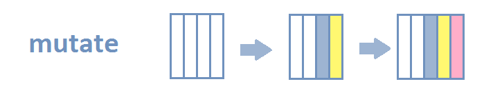
</td><td>
**MODIFIER** les résultats renvoyés.
</td></table>

Données sur films, date de sortie ET année de sortie

```{r spq_mutate}
spq_init() %>%
 spq_add("?film wdt:P31 wd:Q11424", label="?film") %>%   # ?film est un instance de film
 spq_add("?film wdt:P577 ?date") %>%                     # ?film est sorti à la date ?date
 spq_mutate(c("?year"="year(?date)")) %>%                # <= ajoute variable ?year correspondant à l'année de la date
 spq_head(5) %>% 
 send() %>% 
 show()
```

# Package glitter: spq_select()

<table><td style="width:30%">

</td><td>
**SELECTIONNER** les variables renvoyées
</td></table>

Données sur films, localisation narrative, date de sortie ET année de sortie

```{r spq_select}
spq_init() %>%
 spq_add("?film wdt:P31 wd:Q11424", label="?film") %>%   # ?film est une instance de film
 spq_add("?film wdt:P577 ?date") %>%                     # ?film est sorti à la date ?date
 spq_mutate(c("?year"="year(?date)")) %>%                # ?year est l'année correspondant à ?date
 spq_select("-?date") %>%                                # <= on retire la variable ?date
 spq_head(5) %>% 
 send() %>% 
 show()
```

# Package glitter: spq_arrange()

<table><td style="width:30%">

</td><td>
**ORDONNER** les résultats renvoyés.
</td></table>

Personnes nées ou habitant à New York qui font l'objet du plus grand nombre d'articles Wikimedia.

```{r spq_arrange}
spq_init() %>%
  spq_add("?pers wdt:P31 wd:Q5",label="?pers") %>%        # ?pers est une instance de personne
  spq_add("?pers wdt:P19/wdt:P131* wd:Q60") %>%           # qui est née ou est située à New-York
  spq_add("?pers wikibase:sitelinks ?sitelinks") %>%      # ?personne fait l'objet de n liens dans le projet Wikimedia
  spq_arrange(c("desc(?sitelinks)")) %>%                  # <= classe par ordre décroissant de n
  spq_head(n=5) %>%
  send() %>% 
  show()
```

# Package glitter: spq_group_by, spq_summarise()

<table><td style="width:30%">

</td><td>
**GROUPER** et **RESUMER** les résultats renvoyés.
</td></table>

Communes d'Auvergne-Rhône-Alpes qui ont été supprimées lors de la réforme territoriale (nombre par département).

```{r spq_summarise}
tib=spq_init() %>%
  spq_add("?com wdt:P31 wd:Q21869758") %>%          # ?com est une instance de commune disparue
  spq_add("?com wdt:P131* wd:Q18338206") %>%        # ?com est située en Auvergne-Rhône-Alpes
  spq_add("?com wdt:P131* ?dep", label="?dep") %>%  # ?com est située dans ?dep
  spq_add("?dep wdt:P31 wd:Q6465") %>%              # ?dep est une instance de département
  spq_group_by(c("?dep", "?depLabel")) %>%          # Groupe par ?dep et ?depLabel
  spq_summarise(c("?ncomsup"="count(?com)")) %>%    # Résume: ?ncomsup = nb de ?com
  send()

tib %>% show()
```

# Package glitter: perfectible pour les requêtes complexes

{width=100px} Certains éléments de syntaxe restent à simplifier...

<table><td>
**Pour l'instant**, beaucoup de longs "strings" inspirés de SPARQL
```{r pbs_with_glitter_syntax,eval=FALSE}
spq_filter("contains(lcase(?itemTitle),'wikidata')")

spq_filter("lang(?itemTitle)='en'")

spq_mutate(c("?year"="year(?date)"))

spq_select("-?date")    

spq_arrange(c("desc(?sitelinks)"))

spq_group_by(c("?dep", "?depLabel"))

spq_summarise(c("?ncomsup"="count(?com)"))
```

</td><td>
**Dans l'idéal**, une syntaxe qui se rapprocherait le plus possible de:
```{r equ_dplyr_syntax, eval=FALSE}
filter(stringr::str_detect(tolower(itemTitle),"wikidata"))

filter(lang(itemTitle)=="en")

mutate(year=lubridate::year(date))

select(-date)    

arrange(desc(sitelinks))

group_by(dep,depLabel)

summarise(ncomsup=count(com))
```

</td></table>

# 

<h2> Généralisation à l'usage d'autres endpoints </h2>

# Généralisation : dbpedia

{width=100px} Exemple de requête sur le SPARQL endpoint de dbpedia:

```{r dbpedia}
tib=spq_init() %>% 
  spq_add("?person dbo:birthPlace ?place") %>% # ?personne est née à ?place
  spq_add("?person dbo:profession ?job") %>%   # ?personne a pour profession ?job
  spq_add("?job rdfs:label ?jobLabel") %>%     # ?job a pour étiquette ?jobLabel
  spq_filter(c("LANG(?jobLabel)='en'")) %>%    # Filtre pour ne garder que les étiquettes en anglais
  spq_add("?place rdfs:label 'Lyon'@en") %>%   # ?place a pour étiquette 'Lyon' (en anglais)
  spq_head(10) %>% 
  send("dbpedia")                              # Envoie sur le SPARQL endpoint de DBPEDIA
```

```{r show_dbpedia}
show(tib)
```

# Généralisation: hal

{width=100px} Exemple de requête sur le SPARQL endpoint de hal:

```{r hal}
query_doc=spq_init() %>% 
  spq_add("haldoc:inria-00362381 dcterms:hasVersion ?version") %>% # Ce doc a des versions ?version
  spq_add("?version dcterms:title ?title") %>%                     # ?version a pour titre ?titre
  spq_add(". dcterms:creator ?creator") %>%                        # ...... et pour créateur ?creator
  spq_add(". ore:aggregates ?pdf") %>%                             # ...... et ce lien vers un ?pdf
  spq_add("?creator hal:person ?person") %>%                       # ?creator est une personne ?person
  spq_add("?person foaf:name ?name")                               # ?person a pour nom ?name

tib_doc=send(query_doc,"hal")

tib_doc
```


# Généralisation: éléments de simplification

<table><td>
```{r simplifie}
query_doc=spq_init() %>% 
  spq_add("haldoc:inria-00362381 dcterms:hasVersion ?version") %>%
  spq_add("?version dcterms:title ?title") %>%                     
  spq_add(". dcterms:creator ?creator") %>%                        
  spq_add(". ore:aggregates ?pdf") %>%                             
  spq_add("?creator hal:person ?person") %>%                       
  spq_add("?person foaf:name ?name")     
```
</td><td>

```{r quelle_simplification}
query_doc %>% build_sparql() %>% cat()

tib_doc=send(query_doc,"hal")
tib_doc=send(query_doc,"http://sparql.archives-ouvertes.fr/sparql")
```
</td></table>


# Généralisation: préfixes "usuels"

```{r show_usual_prefixes}
show(usual_prefixes)
```


# Généralisation: endpoints "usuels"

```{r show_usual_endpoints}
show(usual_endpoints)
```

# Généralisation: tous les endpoints

⚖️ Données SIPROJURIS: Le parcours biographique de Gaston,Louis, Henry May (1849 - 1940)

```{r symogih_query}
tib=spq_init() %>% 
  spq_prefix(prefixes=c(sym="http://symogih.org/ontology/",         # Préfixe avec sym:
                        syr="http://symogih.org/resource/")) %>%    # Préfixe avec syr:
  spq_add("?tyro rdfs:label ?TyRoLabel") %>% 
  spq_add("?tyin rdfs:label ?TyInLabel") %>% 
  spq_add("?s ?p syr:Actr56241") %>% 
  spq_add(". sym:isComponentOf ?info") %>% 
  spq_add(". sym:hasRoleType ?tyro") %>% 
  spq_add("?info sym:knowledgeUnitStandardLabel ?infoStandardLabel") %>% 
  spq_add(". sym:knowledgeUnitStandardDate ?infoStandardDate") %>% 
  spq_add(". sym:hasKnowledgeUnitType ?tyin") %>% 
  spq_arrange("?infoStandardDate") %>% 
  spq_head(n=10) %>% 
  send(endpoint="http://bhp-publi.ish-lyon.cnrs.fr:8888/sparql")    # Envoie sur le sparql endpoint

show(tib)
```


#

<h2> 🙏 Merci pour votre attention! </h2>


<!-- # ANNEXES -->

<!-- Recrutement de Camille Scheffler (stage M2) et exploration des Wikidata pour deux cas d'études: -->

<!-- - Les jumelages en Europe et dans le monde (Ninon Briot, ENS de Lyon) -->
<!-- - Le [lobbyisme aux USA](http://geoconfluences.ens-lyon.fr/informations-scientifiques/a-la-une/carte-a-la-une/lieux-de-pouvoir-lobbying-etats-unis) -->

<!-- 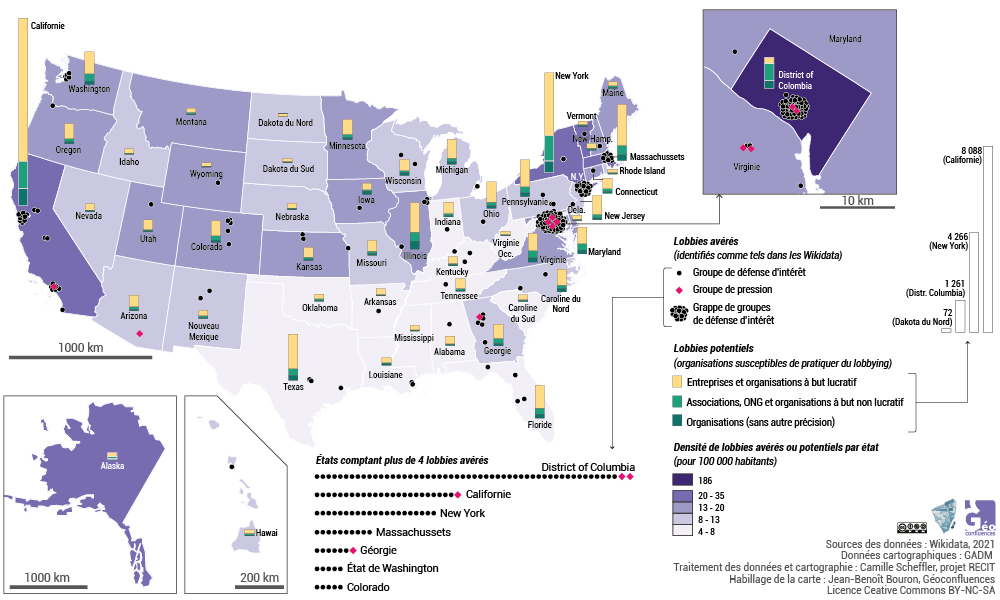{width=800px} -->


<!-- # Requête supp -->


<!-- ```{r, eval=FALSE} -->
<!-- people=spq_init() %>% -->
<!--   spq_add("?louis16 is wd:Q7732") %>% -->
<!--   spq_add("?louis16 (wdt:P22*/wdt:P25*) ?who", label="?who") %>% -->
<!--   spq_select("-?louis16") %>% -->
<!--   spq_language("fr") %>% -->
<!--   send()%>% -->
<!--   mutate(num=1:n()) -->
<!-- ``` -->

<!-- ```{r, eval=FALSE} -->
<!-- list_people=people %>% -->
<!--   clean_wikidata_table() %>% -->
<!--   pull(who) -->

<!-- links=spq_init() %>% -->
<!--   spq_add("?person %in% {list_people}") %>% -->
<!--   spq_add("?person wdt:P22 ?p_father") %>% -->
<!--   spq_add("?person wdt:P25 ?p_mother", label="?p_mother") %>%  -->
<!--   spq_language("fr") %>% -->
<!--   send()  -->

<!-- list_people=bind_rows(people, -->
<!--                       links %>% -->
<!--                         select(who=p_mother,whoLabel=p_motherLabel)) -->


<!-- links=links %>% -->
<!--   select(person,p_father,p_mother) %>%  -->
<!--   tidyr::pivot_longer(cols=starts_with("p_"),  -->
<!--                       names_to="which_parent", -->
<!--                       values_to="parent") -->


<!-- linknew=links %>%  -->
<!--   left_join(people %>% -->
<!--               select(who,num_person=num), -->
<!--             by=c("person"="who")) %>%  -->
<!--   left_join(people %>%  -->
<!--               select(who,num_parent=num), -->
<!--             by=c("parent"="who")) -->
<!-- ``` -->


<!-- ```{r, eval=FALSE} -->
<!-- library(tidygraph) -->
<!-- library(ggraph) -->
<!-- tib_g=tidygraph::tbl_graph(nodes=people, -->
<!--                            edges=linksnew)  -->
<!-- tib_g %>% ggraph(layout="sugiyama") -->

<!-- ``` -->


